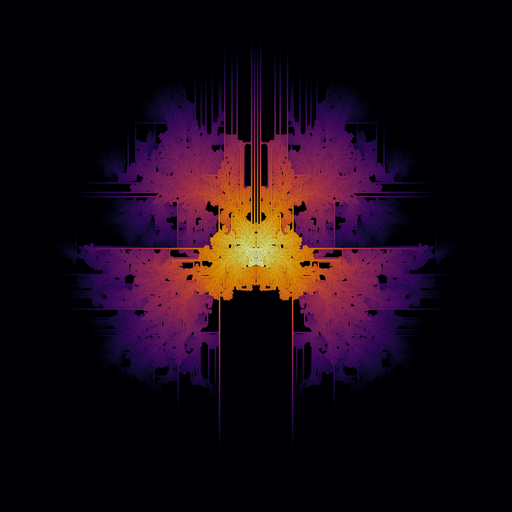
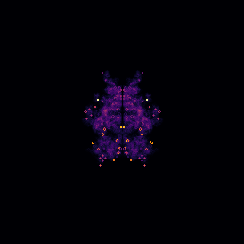
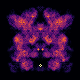
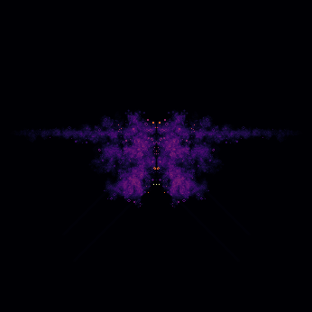

# Carle's Game

<div align="center">

</div>

It was pretty cool when AlphaGo began to beat world-class human Go players. It was even cooler when successive iterations in the AlphaGo lineage were able to play even better without relying on a pre-programmed model of the game rules, especially when MuZero showed it could use the same algorithm and architecture to learn to play Go, chess, shogi, and a suite of Atari games. But each instance of MuZero is still limited to playing in the specialized domain it is trained on, and even expert-level game-playing is a very small corner of intelligence and only an infinitesmal slice of all the interesting things an intelligent agent can do in this universe. Playing the game of Go isn't even the most interesting or impressive thing one can do with a Go board. 

<div align="center">

</div>

The mathematician John H. Conway famously developed the [Game of Life](https://web.stanford.edu/class/sts145/Library/life.pdf) by playing with simple rules and applying them to the stones on a Go board. Over time the capabilities of Life as a computational platform were proven and explored, inspiring an explosion of creative and theoretical work in cellular automata, an impressive achievement that Conway was begrudgingly haunted by for the rest of his life. Proofs of Turing-completeness for Life-like cellular automata continue to be published on internet forums to this day. Interestingly enough the standard way to demonstrate Turing-completeness of a cellular automaton rule set is to design a pattern that can simulate another cellular automata that has already had its computational universality _bona fides_ proven. The many universes of cellular automata have proven to be a rich landscape for creative and intelligent exploration by humans, and Carle's Game proposes that automata offer the same rich possibilities for machine intelligence.

<div align="center">

</div>

Imagine an agent that finds itself in a totally novel universe. The universe is not random, rather it behaves according to some set of definite rules. These rules are unknown to the agent, however they do apply equally to every corner of this universe. At least, the rules would be the same at every corner, if only the universe had corners, but instead it is a 2-dimennsional grid on a torus manifold. There is no gravity, but this universe does have a maximum speed at which information can travel, a "speed of light". What could an intelligent agent learn and build in such a universe? And what happens if the same agent, after exploring a given universe for a while, finds itself deposited in a totally new universe with different physics?

<div align="center">

</div>

This is the premise of Carle's Game. Carle's Game is an open-ended challenge in creative and exploratory machine intelligence.

## Rules

Carle's Game is an official competition at the 2021 IEEE Conference on Games. You can learn more about the conference, and the other competitions, at the [conference website](https://ieee-cog.org/2021/) ([archived snapshot](https://web.archive.org/web/20210201190828/https://ieee-cog.org/2021/)). I'd like to let you know that I hope you enter this year's conference competition, and I am personally rooting for you to come up with something incredible. 

In addition to being an official CoG competition, Carle's Game is first and foremost an open-ended challenge and an experiment in human-machine creative collaboration. You should feel more than welcome to enter the contest after it has ended. Even if in the far-distant future you find CARLE and Carle's Game while excavating the GitHub Arctic Code Vault, you can use the stored copies of this repository and any other remnant artifacts of human civilization to make a valid submission to the contest. Keep in mind that there are no special prizes for entries from future archeologists, alien or otherwise, and I can't guarantee there will be any people left to vote for your submission.

## Prizes

Carle's Game is a challenge in open-endedness and creative machine exploration across multiple cellular automata universes. A major part of the challenge in building an agent to take part in Carle's game is instilling a sense of curiosity and intrinsic reward. This is because the reinforcement learning environment, CARLE, always returns a reward of 0. You'll share the intrinsic motivation part of the challenge with the agents you submit, as there is no cash prize for the winner. HOWEVER, for the first ten (10) contest participants to take part before the August 2021 conference (including judges as well as entrants), I will do my best to send one (1) official Carle's Game t-shirt ["Common Puffer"](https://rivesunder.threadless.com/designs/puffer-progression/mens/t-shirt/regular?color=black), provided you send me your preferred t-shirt size and an address that Threadless ships to. In addition, the top place finisher will likely enjoy immense prestige and glory as befits their creative and innovative prowess. 

## How to Submit to Carle's Game

This repository is the template for submitting to the Carle's Game competition. The steps for making a valid submission are:

1. Fork or clone this repository
2. Program and/or train a machine agent to interact with the CA simulator, CARLE. The `SubmissionAgent` class provides a convenient entry point to inherit from, and the `bokeh-app` and `notebooks` folder provide starting points for showcasing your work.
3. Demonstrate your agent and the process of creating it. I've set up this repository to run CARLE and a machine agent with [mybinder](https://mybinder.org), which lets the judges interact with and observe your agent submission in a docker container hosted by mybinder. Your entire repository and any supporting material (code, parameters, videos, artwork, interpretive dance, etc.) is part of the submission, and judges may be swayed by your brilliant code-writing skills, thought process, champion spirit, etc.
4. Open an [issue](https://github.com/riveSunder/carles_game/issues) in this repository with the subject "Carle's Game Submission." In the issue description, include a link to your forked version of this repository and any other information you want to entice the judges. 

Judges may ask questions or provide feedback for your submission in the comments to your issue, so check back if you'd like to address any questions that come up. Also, if you have been working hard to train an inspiring and creative agent but keep running into some sort of technical challenges, open an issue submission anyway and I'll try to provide advice if I can. Remember that your entire repository history and any activity in your entry comments can be used by the judges to pick their favorites, and good ideas count even if they don't pan out. The IEEE Conference on Games is to be held virtually from August 17th to the 20th, and I expect to name a winner during the conference. I will consider any submissions made by July 30th 2021 (_i.e._ the issue for your submission needs to be opened by 23:59 GMT on that day), and judges can continue to rank entries for one week after that. 

## Become a Judge for Carle's Game and Help Pick the Winner!

Consider this your official invitation to be part of our expert panel on open-endedness and machine intelligence. As a judge, you'll find the entries listed on the [issues page](https://github.com/riveSunder/carles_game/issues) of this repository, with links to the entries in each submission issue description. For your opinion to be counted you'll need to open an issue with "Carle's Game Judging" as the subject and up to 4 of your favorite entries ranked in the issue description. Each judge's ranked votes will grant 1 point to their first choice, 1/2 point to their second choice, 1/3 points to their third choice and 1/4 points to the 4th. Your votes will only be counted once, but you can amend them until 2021 August 6th by commenting on your own issue and the most recent ranking will be considered. Each judge is allowed only one ranked voting submission (with optional amendments). Each "Judge" is defined as an individual human person, and pretending to be more than one person is considered cheating. I'll use GitHub IDs as a proxy for human individuals, and while I really hope no one feels they need to cheat at judging, as the contest's benevolent autocrat I reserve the right to both be really upset if you do, and to be the final arbiter of submitted votes. 

## In Summary

There are 262,144 different variations of Life-like cellular automata "universes," and in addition to quite a few of these being provably Turing-complete, many demonstrate characteristics of life-like growth and decay. Consequentially Life-like CA are a fertile landscape for open-ended and creative machine exploration, and a real challenge for modern artificial intelligence. In all likelihood, this chalenge is beyond the capabilities of modern state-of-the-art machine learning algorithms, but I am certainly rooting for you and looking forward to seeing what your creations create.

<hline></hline>

## Installation

I am testing with and recommend using `virtualenv` to create python virtual environments for managing dependencies. If you already have `virtualenv` installed, you can create and then activate a new environment with the following commands:

```
virtualenv carles_venv --python=python3
source carles_venv/bin/activate 
```

Note that I am using Ubuntu 18. If you are using a different operating system and/or have a different experience setting up or using CARLE and Carle's Game, feel free to send me your notes (go ahead and open an issue) and I will update the installation instructions here. 

```
git clone  https://github.com/riveSunder/carles_game.git
cd carles_game
pip install -e .

# install the environment, CARLE
git clone https://github.com/riveSunder/carle.git

cd carle

pip install -e .

# run tests if you want
python -m test.test_all

# go back to the root directory and see if CARLE is working
cd ../
python -c "from carle.env import CARLE; env = CARLE(); obs = env.reset(); print('Looks OK')"
```


##

The current evaluation template is a Jupyter notebook using Bokeh for interactive plotting. To launch a Jupyter notebook session:

```
jupyter notebook
```

However the scheme for running on notebook server [mybinder.org](https://mybinder.org) is a little more involved and uses `bokeh serve`. You can create an interactive bokeh app server on mybinder by following the link below.

[`https://mybinder.org/v2/gh/riveSunder/carles_game/master?urlpath=/proxy/5006/bokeh-app`](https://mybinder.org/v2/gh/riveSunder/carles_game/master?urlpath=/proxy/5006/bokeh-app)
